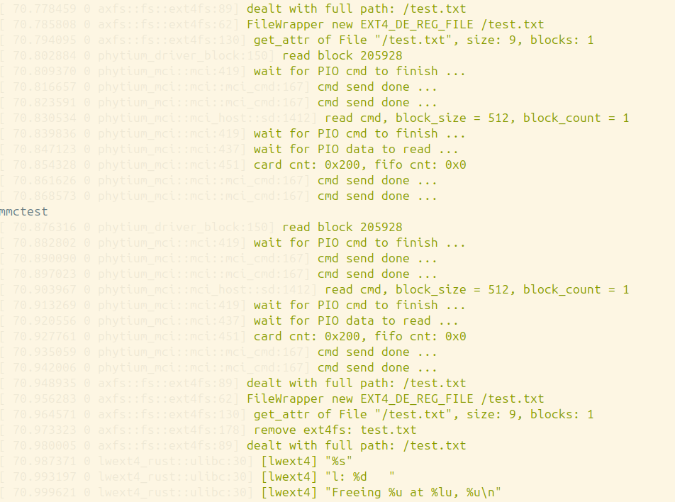

### Arceos驱动测试技术文档

[TOC]

<div style="page-break-after: always;"></div>

### 一、测试概述

#### 1.1 测试背景与目标

在嵌入式系统开发中，驱动程序作为硬件与操作系统之间的桥梁，其稳定性和功能性直接决定了整个系统的运行效率与可靠性。Arceos 作为一款面向嵌入式场景的操作系统，需在不同硬件平台上实现对各类外设的有效驱动支持。飞腾派开发板基于国产飞腾处理器，具备高性能、低功耗等特性，是 Arceos 操作系统重要的适配硬件之一。

本次测试旨在全面验证 Arceos 操作系统在飞腾派开发板上各类驱动的功能正确性、稳定性及兼容性，覆盖基本外设驱动与复杂功能驱动，为后续 Arceos 系统在飞腾派平台的应用与优化提供可靠的测试依据，确保驱动程序能够满足实际嵌入式应用场景的需求。

#### 1.2 测试环境构成

整个测试环境由两个部分组成，一个作为测试机，其上运行Linux，另一个是飞腾派（被测试开发板），其上运行Arceos。具体配置与连接方式如下：

| 设备         | 配置说明                                                     | 功能角色                                                     |
| ------------ | ------------------------------------------------------------ | ------------------------------------------------------------ |
| 测试机       | 操作系统：Linux（推荐 Ubuntu 24.04 及以上版本）<br>硬件要求：CPU 双核及以上，内存 4GB 及以上，空闲磁盘空间 10GB 及以上 | 1. 编译测试所需镜像文件<br>2. 安装并运行测试依赖工具与脚本<br>3. 发起驱动测试任务，控制测试流程<br>4. 接收并分析测试结果，生成测试日志 |
| 飞腾派开发板 | 处理器：飞腾系列嵌入式 CPU<br>内存：2GB 及以上 DDR4<br>存储：支持 microSD 卡或 eMMC 存储<br>接口：12 针调试串口、40针通用 GPIO 接口、USB 接口等 | 1. 运行 Arceos 操作系统，作为驱动测试的目标硬件平台<br>2. 提供各类外设接口（如 UART、I2C、SPI 等），供驱动测试调用<br>3. 通过调试串口与测试机通信，反馈测试过程中的硬件状态 |

#### 1.3 硬件连接规范

测试机需通过 **USB 转 TTL 模块** 与飞腾派的 12 针调试串口连接，实现数据交互与测试控制，具体接线对应关系如下：


- 飞腾派12针接口：12pin为GND，接USB转TTL的GND
- 飞腾派12针接口：10pin为RX，接USB转TTL的TX
- 飞腾派12针接口：8pin为TX，接USB转TTL的RX

连接完成后，可通过测试机的 `ls /dev/ttyUSB*` 命令确认串口设备是否正常识别。

<div style="page-break-after: always;"></div>

### 二、基本驱动的测试

基础驱动测试覆盖飞腾派开发板上常用的外设驱动，包括 reset、clock、GPIO 等，测试流程统一分为“测试机准备”“飞腾派准备”“发起测试”三个阶段，各驱动测试的核心差异体现在测试内容、专属配置与结果验证方式上。

#### 2.1 测试前的准备

- 测试机上的准备

```sh
# 在测试机上运行
git clone --recursive https://github.com/shzhxh/driver-test.git
cd driver-test
make build  # 编译测试镜像，生成的镜像在shell目录下

# 安装测试依赖
python3 -m venv ~/.venv
source ~/.venv/bin/activate
pip3 install -r ./scripts/requests.txt
deactivate
```

- 飞腾派上的准备

```sh
# 在测试机上运行。要求：飞腾派上已运行Linux，且与测试机在同一局域网。
scp shell/shell*.bin user@192.168.1.100:arceos.bin

# 在飞腾派上运行  
sudo shutdown -r now  # 重启飞腾派，按任意键进入uboot
# 在uboot下执行如下命令
ext4load mmc 0:1 0x90100000 /home/user/arceos.bin
dcache flush
go 0x90100000   # 启动Arceos
```

<div style="page-break-after: always;"></div>

#### 2.2 测试机上发起测试

1. 关闭串口占用程序。当开始测试时，测试机上读写飞腾派调试串口的程序应保持关闭。

2. 要修改的python文件里的配置，使与实际情况相符。

   - `scripts/conftest.py` : `port`默认是`/dev/ttyUSB0`。若测试机识别的串口为其他设备（如 `/dev/ttyUSB1`），需修改 `port` 参数。

   - `scripts/test_uart_driver.py`：配置 UART 测试专用串口，默认值为 `/dev/ttyUSB1`，需根据实际连接的 USB 转 TTL 模块端口调整 `TEST_UART_PORT` 参数。


##### 2.2.1 reset测试

Watchdog（看门狗）驱动是嵌入式系统中保障稳定性的关键组件，其核心功能是：若系统出现死锁或无响应，Watchdog 定时器超时后会自动触发系统复位（reset）。

本次 reset 测试的目的：验证 Arceos 的 Watchdog 驱动能否正常初始化、启动定时器，并在“不喂狗”（未按时重置定时器）的情况下触发飞腾派重启，确保驱动的故障恢复能力。

1. **前置检查**

   确认飞腾派已成功启动 Arceos，且测试机与飞腾派的串口通信正常。

2. **执行测试命令**

   在测试机的 Python 虚拟环境中，通过 `pytest` 执行 reset 测试（仅运行标记为 `reset` 的测试用例）：

```sh
# 运行测试。
source ~/.venv/bin/activate
pytest -v -m reset # 日志记录在output目录下
deactivate
```
3. **测试结果验证**

   观察测试机终端输出与飞腾派状态。飞腾派应在测试过程中自动重启。


<div style="page-break-after: always;"></div>

##### 2.2.2 clock测试

Clock（时钟）驱动是所有外设工作的基础，外设（如 UART、SPI）的速率、定时器精度均依赖于稳定的时钟信号。

本次 clock 测试的目的：验证 Arceos 的 Clock 驱动能否正常初始化 CRU 模块，并将指定外设的时钟频率精确设置为 50MHz，确保时钟信号的稳定性与准确性。

1. **执行测试命令**

   在测试机虚拟环境中运行 clock 测试：

```sh
source ~/.venv/bin/activate
pytest -v -m clock # 日志记录在output目录下
deactivate
```
2. **测试结果验证**


<div style="page-break-after: always;"></div>

##### 2.2.3 GPIO测试

GPIO（通用输入输出）驱动是嵌入式系统中控制外部硬件（如指示灯、继电器）的核心，支持配置引脚为输入或输出模式，并通过设置电平（高/低）实现对外部设备的控制。

本次 GPIO 测试的目的：验证 Arceos 的 GPIO 驱动能否正常初始化指定引脚、配置为输出模式，并通过切换高低电平控制调试灯的亮灭，确保驱动的电平控制功能正常。

1. **执行测试命令**

```sh
source ~/.venv/bin/activate
pytest -vs -m gpio # 日志记录在output目录下
deactivate
```
2. **测试结果验证**  

   测试过程中，测试机会提示“即将执行 gpio_test 测试命令，请观察调试灯，按 Enter 键开始...”，按下 Enter 后，LED 应交替闪烁（高电平时亮，低电平时灭），周期约 1s。观察到 LED 闪烁后，在测试机终端输入“OK”并回车，测试日志应显示 `PASSED`。


<div style="page-break-after: always;"></div>

##### 2.2.4 I2C测试

I2C（Inter-Integrated Circuit）是一种双线串行通信协议，广泛用于连接传感器、显示屏等外设。Arceos 的 I2C 驱动需实现：初始化 I2C 控制器、发送/接收数据、与外设建立通信等功能。

本次 I2C 测试的目的：通过向 I2C OLED 屏写入显示数据，验证 I2C 驱动能否正常初始化、与外设建立连接，并正确传输数据，确保驱动的通信功能正常。

1. **硬件准备**

需要准备一个I2C oled屏，与飞腾派的40pin接口连接，接线方式如下：


- 飞腾派40pin接口：1pin为3V3，接OLED屏的VCC
- 飞腾派40pin接口：9pin为GND，接OLED屏的GND
- 飞腾派40pin接口：3pin为SDA，接OLED屏的SDA
- 飞腾派40pin接口：5pin为SCL，接OLED屏的SCL

2. **执行测试命令**

```sh
source ~/.venv/bin/activate
pytest -vs -m i2c # 日志记录在output目录下
deactivate
```
3. **测试结果验证**

I2C屏幕测试结果：


I2C脚本运行结果：


<div style="page-break-after: always;"></div>

##### 2.2.5 pinmux测试

pinmux（引脚复用）是嵌入式硬件中实现引脚多功能的关键技术：同一引脚可通过 pinmux 配置为不同功能（如 GPIO、UART_TX、SPI_SCK 等）。Arceos 的 pinmux 驱动需实现：读取引脚当前功能、配置引脚为目标功能、验证功能切换有效性等。

本次 pinmux 测试的目的：将飞腾派的指定引脚从默认的 GPIO 功能配置为 UART 功能，验证 pinmux 驱动能否正常初始化、切换引脚功能，并确保切换后 UART 驱动可正常使用（后续 UART 测试会依赖此配置）。

1. **执行测试命令**

```sh
source ~/.venv/bin/activate
pytest -v -m pinmux # 日志记录在output目录下
deactivate
```
2. **测试结果验证**


<div style="page-break-after: always;"></div>
##### 2.2.6 PWM测试

PWM（脉冲宽度调制）是通过改变脉冲信号的占空比（高电平时间/周期）来控制外设的技术，广泛用于电机调速、LED 亮度调节等场景。Arceos 的 PWM 驱动需实现：初始化 PWM 控制器、设置频率与占空比、输出 PWM 信号等功能。

本次 PWM 测试的目的：验证 PWM 驱动能否正常初始化，并输出不同占空比（1%、25%、50%、75%、100%）的 PWM 信号，确保驱动对占空比的精确控制能力。

1. **执行测试命令**

```sh
source ~/.venv/bin/activate
pytest -v -m pwm # 日志记录在output目录下
deactivate
```

2. **测试结果验证**

   测试日志应显示 7 个测试用例全部 PASSED。


<div style="page-break-after: always;"></div>

##### 2.2.7 spi测试

SPI（Serial Peripheral Interface）是一种高速同步串行通信协议，支持全双工通信，常用于连接 Flash、ADC 等高速外设。Arceos 的 SPI 驱动需实现：初始化 SPI 控制器、配置通信参数（如时钟极性、相位）、发送/接收数据等功能。

本次 SPI 测试采用“自收自发”模式：将飞腾派 SPI 接口的 TX（发送）引脚与 RX（接收）引脚短接，驱动发送一组测试数据后，读取接收引脚的数据，验证发送与接收的数据是否一致，从而确认 SPI 驱动的通信功能正常。

1. **硬件准备**

飞腾派 40pin 接口中，spi接线方式如下：


- 飞腾派40pin接口：19pin短接21pin(TX和RX短接)

  | 飞腾派 40pin 接口 | 引脚功能            | 操作说明                            |
  | ----------------- | ------------------- | ----------------------------------- |
  | 19pin             | SPI0_TX（发送引脚） | 与 21pin 短接（使用杜邦线直接连接） |
  | 21pin             | SPI0_RX（接收引脚） | 与 19pin 短接                       |

2. **执行测试命令**

```sh
source ~/.venv/bin/activate
pytest -v -m spi # 日志记录在output目录下
deactivate
```

3. **测试结果验证**


<div style="page-break-after: always;"></div>

##### 2.2.8 timer测试

Timer（定时器）驱动是嵌入式系统中实现定时任务、延时控制的核心，其功能包括：初始化定时器、设置定时周期、触发中断（定时到期通知 CPU）等。本次测试通过“转速计（tacho）”场景验证 Timer 功能。

1. **执行测试命令**

```sh
source ~/.venv/bin/activate
pytest -v -m timer # 日志记录在output目录下
deactivate
```

2. **测试结果验证**


<div style="page-break-after: always;"></div>

##### 2.2.9 UART测试

UART（通用异步收发传输器）是嵌入式系统中最常用的串行通信接口，用于设备间的异步数据传输（无需时钟线）。Arceos 的 UART 驱动需支持不同波特率（如 9600、115200）、数据位、停止位的配置，并能稳定发送/接收数据。

本次 UART 测试的目的：在不同波特率下，通过 UART 接口发送测试数据，验证驱动能否正确配置波特率、稳定传输数据，确保 UART 通信的兼容性与可靠性。

1. **硬件准备**

   飞腾派需通过 **USB 转 TTL 模块** 与测试机连接，接线方式如下：


- 飞腾派40pin接口：10pin为RX，接USB转TTL的TX
- 飞腾派40pin接口：8pin为TX，接USB转TTL的RX
- 飞腾派40pin接口：6pin为GND，接USB转TTL的GND

2. **执行测试命令**

```sh
source ~/.venv/bin/activate
pytest -v -m uart # 日志记录在output目录下
deactivate
```

3. **测试结果验证**

   测试日志应显示 6 个测试用例全部 PASSED。


<div style="page-break-after: always;"></div>

##### 2.2.10 watchdog测试

Watchdog 驱动的核心功能是“喂狗”机制：系统正常运行时，需定期（在定时器超时前）向 Watchdog 发送“喂狗”指令，重置定时器；若系统故障（如死锁），无法按时喂狗，Watchdog 会触发系统重启。

本次 watchdog 测试的目的：验证 Watchdog 驱动能否正常初始化、启动定时器，以及在“不喂狗”情况下触发系统重启。

1. **执行测试命令**

```sh
source ~/.venv/bin/activate
pytest -v -m watchdog # 日志记录在output目录下
deactivate
```
2. **验证测试结果**


<div style="page-break-after: always;"></div>
### 三、对复杂驱动的测试

复杂驱动测试覆盖 Arceos 中依赖多模块协同工作的驱动，包括 DMA（直接内存访问）、GIC（通用中断控制器）、UVC（USB 视频类设备）等，测试流程需结合硬件协同与多驱动联动，验证系统级功能的稳定性。

#### 3.1 测试前的准备

```sh
# 在测试机上执行
sudo apt install libudev-dev
cargo install ostool    # 安装辅助工具
git clone https://github.com/chenlongos/arceos-driver.git -b phytium-camp
cd arceos
```
<div style="page-break-after: always;"></div>

#### 3.2 DMA和GIC测试

##### 3.2.1 测试原理与目的

- **DMA（直接内存访问）**：无需 CPU 参与，直接实现外设与内存之间的数据传输，可大幅提升数据传输效率（如 UART 大数据量传输）。
- **GIC（通用中断控制器）**：管理系统中所有中断请求，包括 DMA 传输完成中断（DMA 传输结束后，通过 GIC 向 CPU 发送中断通知，CPU 再处理后续任务）。

本次 DMA 和 GIC 测试通过“UART 回环测试”验证：DMA 能否通过 UART 接口完成数据传输，且传输完成后 GIC 能否正确触发中断通知 CPU，确保 DMA 驱动的传输功能与 GIC 驱动的中断管理功能协同工作正常。

##### 3.2.2 执行测试命令

1. **配置测试项目**

   复制 DMA 测试的项目配置模板，如有需要可修改环境配置。

```sh
cp phytium/app/test-ddma/.project.toml-example ./project.toml
```

2. **启动测试并加载Arceos**

   使用 `ostool` 工具启动测试，并在 U-Boot 中加载 Arceos。

```
ostool run uboot
```

##### 3.2.3 测试结果验证

测试程序运行结果，需确认以下关键信息：

- `DDMA controller reset done`：DMA 控制器初始化成功。
- `UART initialized`：UART 驱动初始化成功。
- `IRQ set enable: true`：GIC 成功启用 DMA 传输完成中断（IRQ 编号可能因硬件不同而变化）。
- `Input buffer: [65, 0, ..., 66]` 与 `Output buffer: [65, 0, ..., 66]`：发送数据与接收数据一致（UART 回环传输成功）。
- `DMA transfer completed successfully!`：DMA 传输完成，测试成功。


<div style="page-break-after: always;"></div>
#### 3.3 UVC和USB测试

##### 3.3.1 测试原理与目的

- **USB 驱动**：实现 Arceos 对 USB 总线的管理，支持枚举 USB 设备（如 UVC 摄像头）、建立 USB 通信链路。
- **UVC（USB Video Class）驱动**：专门用于支持 USB 视频设备（如摄像头），实现视频帧的采集、传输与解码。

本次 UVC 和 USB 测试的目的：验证 USB 驱动能否正常枚举 UVC 摄像头，UVC 驱动能否采集摄像头的视频帧，并对视频帧的颜色（主题色）进行检测，确保 USB 总线管理与 UVC 视频采集功能正常。

##### 3.3.2 硬件准备

将一个 **USB UVC 兼容摄像头**（如普通电脑摄像头）通过 USB 线连接到飞腾派的 USB 接口。

注：需要连接远离电路板的那个USB3.0接口。

##### 3.3.3 执行测试命令

1. **配置测试项目**

   复制 UVC 测试的项目配置模板，如有需要还可以修改该配置模板。

```sh
cp phytium/app/uvc-detect/.project.toml-example ./project.toml
```

2. **启动测试并加载Arceos**

```sh
ostool run uboot
```

##### 3.3.4 测试结果验证

测试程序运行结果：


<div style="page-break-after: always;"></div>
#### 3.4 MMC测试

##### 3.4.1 测试原理与目的

通过对sd卡上的ext4文件系统读写sd卡，来验证mmc驱动的功能。

##### 3.4.2 硬件准备

把包含ext4文件系统的启动镜像刻录到一个SD卡上，并把SD卡插入飞腾派的卡槽。

##### 3.4.3 执行测试命令

1. 切换分支

   ```sh
   git switch 45-动态plat-make-脚本接口适配
   ```

2. 创建`.project.toml`文件，并输入如下内容：

```sh
[compile]
target = "aarch64-unknown-none"

[compile.build.Custom]
shell = ["make PLATFORM=aarch64-dyn SMP=1 A=examples/shell  FEATURES=irq,driver-phytium-sdcard,ext4fs,fs"]
kernel = "./examples/shell/shell_aarch64-dyn.bin"

[qemu]
machine = "virt"
cpu = "cortex-a57"
graphic = false
args = ""

[uboot]
serial = "/dev/ttyUSB0" // 根据具体情况修改
baud_rate = 115200
dtb_file = "./tools/phytium_pi/phytiumpi_firefly.dtb"

[uboot.net]
interface = "wlp0s20f3" // 根据具体情况修改
```

3. 启动测试并加载Arceos

   ```sh
   ostool run uboot
   ```

   

##### 3.4.4 测试结果验证

测试程序运行结果，从日志输出中可见：

1. 在文件系统中创建了文件`./test.txt`
2. 向文件中写了字符串并把文件的内容打印出来：`mmctest`
3. 在文件系统中删除了文件`./test.txt`



### 四、测试总结

本次 Arceos 驱动测试覆盖飞腾派开发板的 **13 类驱动**，包括 11 类基础驱动与 2 类复杂驱动，测试结果统计如下：

| 驱动类型 | 驱动名称  | 测试用例数量 | 通过数量 | 通过率   | 核心验证点                    |
| -------- | --------- | ------------ | -------- | -------- | ----------------------------- |
| 基础驱动 | reset     | 2            | 2        | 100%     | Watchdog 触发系统重启         |
| 基础驱动 | clock     | 2            | 2        | 100%     | 时钟频率设置（50MHz）         |
| 基础驱动 | GPIO      | 2            | 2        | 100%     | 高低电平控制 LED 亮灭         |
| 基础驱动 | I2C       | 2            | 2        | 100%     | 向 OLED 屏写入显示数据        |
| 基础驱动 | pinmux    | 2            | 2        | 100%     | 引脚功能切换（GPIO→UART）     |
| 基础驱动 | PWM       | 7            | 7        | 100%     | 多占空比 PWM 信号输出         |
| 基础驱动 | SPI       | 2            | 2        | 100%     | 自收自发数据一致性            |
| 基础驱动 | timer     | 1            | 1        | 100%     | 定时采集转速数据              |
| 基础驱动 | UART      | 6            | 6        | 100%     | 多波特率数据传输              |
| 基础驱动 | Watchdog  | 2            | 2        | 100%     | 不喂狗则触发系统重启          |
| 复杂驱动 | DMA + GIC | 1            | 1        | 100%     | UART 回环 DMA 传输 + 中断触发 |
| 复杂驱动 | UVC + USB | 1            | 1        | 100%     | UVC 摄像头视频采集 + 颜色检测 |
| **总计** | **13 类** | **30**       | **30**   | **100%** | **所有驱动功能正常**          |

本次测试结果表明，Arceos 操作系统在飞腾派开发板上的 **13 类驱动均能正常工作**，功能正确性与稳定性满足嵌入式系统的基础需求。驱动能够正确初始化硬件、响应软件指令，并实现预期的硬件控制或数据传输功能，为后续 Arceos 在飞腾派平台的应用开发提供了可靠的驱动支持。
