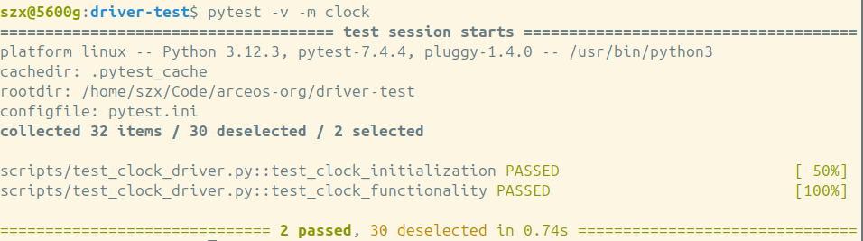
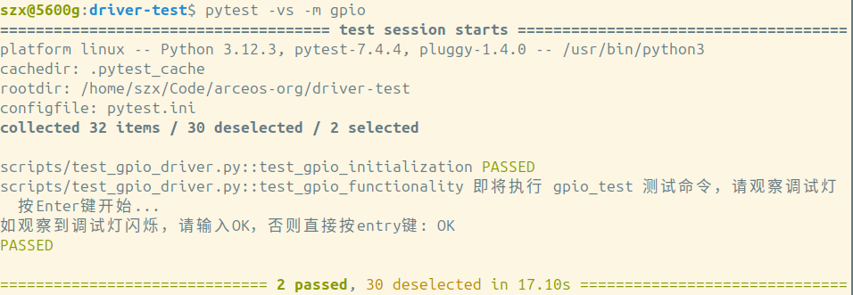

Arceos driver test

整个测试环境由两个部分组成，一个作为测试机，其上运行Linux，另一个是飞腾派（被测试开发板），其上运行Arceos。

测试机通过USB和飞腾派的调试串口进行通信：


- 飞腾派12针接口：12pin为GND，接USB转TTL的GND
- 飞腾派12针接口：10pin为RX，接USB转TTL的TX
- 飞腾派12针接口：8pin为TX，接USB转TTL的RX

#### 测试机上的准备

```sh
# 在测试机上运行
git clone --recursive https://github.com/shzhxh/driver-test.git
cd driver-test
make build  # 编译测试镜像，生成的镜像在shell目录下

# 安装测试依赖
python3 -m venv ~/.venv
source ~/.venv/bin/activate
pip3 install -r ./scripts/requests.txt
deactivate
```

#### 飞腾派上的准备

```sh
# 在测试机上运行。要求：飞腾派上已运行Linux，且与测试机在同一局域网。
scp shell/shell*.bin user@192.168.1.100:arceos.bin

# 在飞腾派上运行  
sudo shutdown -r now  # 重启飞腾派，按任意键进入uboot
# 在uboot下执行如下命令
ext4load mmc 0:1 0x90100000 /home/user/arceos.bin
dcache flush
go 0x90100000   # 启动Arceos
```

#### 测试机上发起测试

注：当开始测试时，测试机上读写飞腾派调试串口的程序应保持关闭。

注：要修改scripts/目录下的py文件里的配置，使与实际情况相符。
- scripts/conftest.py : port默认是/dev/ttyUSB0，如果不是则需要修改。
- scripts/test_uart_driver.py：TEST_UART_PORT默认是/dev/ttyUSB1，如果不是则需要修改。

##### reset测试

测试内容为使用watchdog重启飞腾派。


   
```sh
# 运行测试。
source ~/.venv/bin/activate
pytest -v -m reset # 日志记录在output目录下
deactivate
```

##### clock测试

测试内容为把clock频率设置为50MHz。



```sh
source ~/.venv/bin/activate
pytest -v -m clock # 日志记录在output目录下
deactivate
```
##### GPIO测试

测试内容为使用GPIO输出高低电平以控制调试灯的亮灭。



```sh
source ~/.venv/bin/activate
pytest -vs -m gpio # 日志记录在output目录下
deactivate
```

##### I2C测试

测试内容为向I2C屏幕写入数据。

I2C oled屏接线方式：


- 飞腾派40pin接口：1pin为3V3，接OLED屏的VCC
- 飞腾派40pin接口：9pin为GND，接OLED屏的GND
- 飞腾派40pin接口：3pin为SDA，接OLED屏的SDA
- 飞腾派40pin接口：5pin为SCL，接OLED屏的SCL

I2C屏幕测试结果：


I2C脚本运行结果：


```sh
source ~/.venv/bin/activate
pytest -vs -m i2c # 日志记录在output目录下
deactivate
```

##### pinmux测试

测试内容为把引脚配置为UART功能。


```sh
source ~/.venv/bin/activate
pytest -v -m pinmux # 日志记录在output目录下
deactivate
```

##### PWM测试

测试内容为设置不同的占空比。


```sh
source ~/.venv/bin/activate
pytest -v -m pwm # 日志记录在output目录下
deactivate
```

##### spi测试

测试内容为自收自发，判断收发的数据是否一致。

spi接线方式：


- 飞腾派40pin接口：19pin短接21pin(TX和RX短接)

spi测试脚本运行结果：


```sh
source ~/.venv/bin/activate
pytest -v -m spi # 日志记录在output目录下
deactivate
```

##### timer测试

测试内容为通过转速计tacho来测试timer的功能。


```sh
source ~/.venv/bin/activate
pytest -v -m timer # 日志记录在output目录下
deactivate
```

##### UART测试

在不同的波特率下进行UART的收发测试。

UART的接线方式：


- 飞腾派40pin接口：10pin为RX，接USB转TTL的TX
- 飞腾派40pin接口：8pin为TX，接USB转TTL的RX
- 飞腾派40pin接口：6pin为GND，接USB转TTL的GND

UART测试脚本运行结果：


```sh
source ~/.venv/bin/activate
pytest -v -m uart # 日志记录在output目录下
deactivate
```

##### watchdog测试

不喂狗测试系统是否会重启。


```sh
source ~/.venv/bin/activate
pytest -v -m watchdog # 日志记录在output目录下
deactivate
```

#### 其它不使用测试脚本的测试

##### 准备工作

```sh
# 在测试机上执行
sudo apt install libudev-dev
cargo install ostool    # 安装辅助工具
git clone https://github.com/arceos-hypervisor/arceos.git -b phytium-camp
cd arceos
```

##### DMA和GIC测试

通过uart回环测试dma的功能，当传输完成会通过gic中断通知cpu。

```sh
cp phytium/app/test-ddma/.project.toml-example ./project.toml
ostool run uboot
```

测试程序运行结果：


##### UVC和USB测试

通过UVC摄像头接收视频帧，并检测视频帧的颜色。

```sh
cp phytium/app/uvc-detect/.project.toml-example ./project.toml
ostool run uboot
```

测试程序运行结果：


