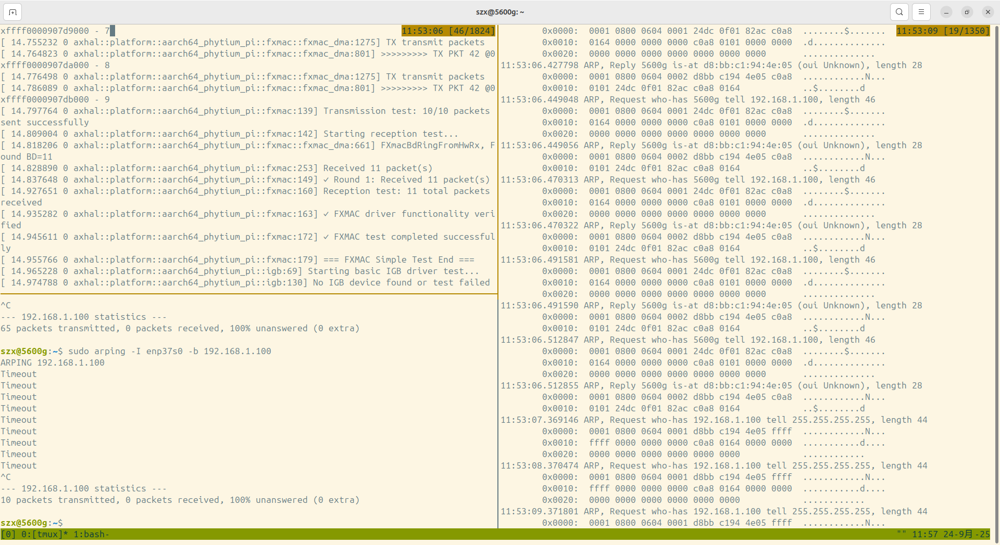

#### 硬件要求

飞腾派的eth0网口(靠近usb接口)和主机的网口，通过网线连接。

#### 测试命令

需要打开３个终端窗口：

一个窗口用于编译arceos镜像，并连接uart

```
# 编译镜像
cd driver_test
make build LOG=info

# 复制到sd卡
sudo mount /dev/sdb1 /mnt
cp shell/shell_aarch64_phytium_pi.bin /mnt/arceos.bin
sudo umount /mnt

读取调试串口
minicom -D /dev/ttyUSB0

# sd卡插入飞腾派，启动并进入uboot
ext4load mmc 0 0x90100000 /arceos.bin
dcache flush
go 0x90100000
```

一个窗口用于读取arp包

```
tcpdump -i enth0 -X host 192.168.1.100
```

一个窗口用于发送arp包

```
arping -b -I enth0 192.168.1.100
```

#### 结果验证

连接uart的窗口应观察到如下输出：

- `Transmission test: 10/10 packets sent successfully`

- `Reception test: 11 total packets`
- `✓ FXMAC driver functionality verified`
- `✓ FXMAC test completed successfully`

读取arp包的窗口应观察到如下三种arp包：

- 飞腾派发出的arp请求：`ARP, Request who-has 5600g tell 192.168.1.100, length 46`
- 主机回应的arp请求：`ARP, Reply 5600g is-at d8:bb:c1:94:4e:05 (oui Unknown), length 28`
- 主机发出的arp请求：`ARP, Request who-has 192.168.1.100 tell 255.255.255.255, length 44`

